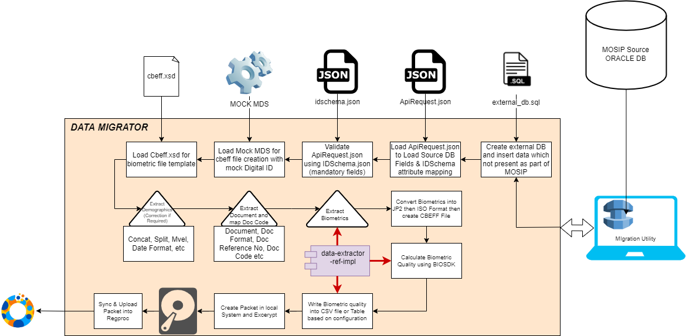

<!--[](https://github.com/mosip/print/actions/workflows/push_trigger.yml)
[](https://sonarcloud.io/dashboard?branch=release-1.2.0.1&id=mosip_admin-services) -->
# Data MIgrator Tool
## Overview
A reference implementation to data migration from source system (`ORACLE`, `POSTGRES`, `MSSQL`, `MYSQL`) to MOSIP powered Destination system.

This Tool read individual Data (Demograhic, Biometric & Documents) from source system and perform conversion and formatting as per the MOSIP defined ID Schema.

Create JSON that combines formatted demographic, biometric & documents which MOSIP packet manager understand and call packet manager as library to create packet in local storage and encrypt.

Once packet created, system will sync then upload same into registration processor to process further.


## Architecture


## prerequisite
1. This Tool will run as either `Data Migrator` or `Quality Analysis` (Disabling Packet creation & Upload function by configuration).
2. This Tool can run either `Batch mode` or `Interactive mode (REST API Call)`

    ###For Data Migrator
    1. This Tool should be run either `Desktop` or `Laptop`, which have TPM Enabled. (TPM Required for Packet Signing)
    2. Country should have MOSIP working environment (Sandbox). ID Schema & Master Data will fetch from MOSIP during Initialization. 
    3. ID Schema should be finalized and should be updated into MOSIP master database before starting migration.
    4. Machine (Desktop/Laptop) should be onboarded into MOSIP.
    5. MockMDS L0(Registration Device) should be created and place the `.p12` file into mockmds folder in resource path. 
    6. Registration Processor API's (`sync` & `upload`) should be accessable in the system.
   
    ###For Quality Analyzer
    1. This Tool can run in either server or Local system. TPM not played any role here because of no packet creation.
    2. Country not necessary to have MOSIP working environment (Sandbox). but ID Schema should be present. 
    3. ID Schema should be finalized before starting quality analyzer.

<!--## Build and run (for developers)
Refer [Build and Run](docs/build-and-run.md). -->
    
## Deploy
The deploy Data Migrator/Quality Analyzer follow the given steps:

1. Update application-default.properties for hosts, Database, Reference Class, BIOSDK api's, etc
2. Place your ID Schema (`idschema.json`) file in `../src/main/resources` folder.
3. Place your CBEFF (`cbeff.xsd`) file in  `../src/main/resources` folder.
4. Place your Identity (`identity.json`) file in  `../src/main/resources` folder.
5. Place your updated External DB SQL (`external_db.sql`) file in  `../src/main/resources` folder.
6. For Data Migrator
   1. Onboard Device Partner for MOCK MDS and place `Device.p12` file in `../src/main/resources/mockmds` folder.
   2. Create Mvel Expression if any based on your requirement and place into `../src/main/resources` folder.
   3. Configure mosip-config (`application-default.properties` & `registration-processor-default.properties`) for Tool (Source = MIGRATOR) Configuration.
   4. Create new Camel Route (`registration-processor-camel-routes-migrator-default.xml`) and place into `mosip-config` repository
7. For Quality Analyzer
   1. Enable following property in application-default.properties
   `mosip.extractor.enable.quality.check.only=false`
8. For Batch Mode
   1. Place your API Request JSON (ApiRequest.json) file in `../src/main/resources` folder. 
9. Build and run as given <!-- [here](docs/build-and-run.md). -->

<!-- ## Configuration
Refer to the [configuration guide](docs/configuration.md).

## Test
Automated functaionl tests available in [Functional Tests repo](https://github.com/mosip/mosip-functional-tests).

## License
This project is licensed under the terms of [Mozilla Public License 2.0](LICENSE).
-->

### Property Changes
1. application-default.properties
```mosip.kernel.idobjectvalidator.mandatory-attributes.reg-processor.migrator=IDSchemaVersion
packetmanager.default.priority=source:REGISTRATION_CLIENT\/process:BIOMETRIC_CORRECTION|NEW|UPDATE|LOST,source:RESIDENT\/process:ACTIVATED|DEACTIVATED|RES_UPDATE|RES_REPRINT,source:OPENCRVS\/process:OPENCRVS_NEW,source:DATAMIGRATOR\/process:NEW
provider.packetreader.mosip=source:REGISTRATION_CLIENT|DATAMIGRATOR,process:NEW|UPDATE|LOST|BIOMETRIC_CORRECTION,classname:io.mosip.commons.packet.impl.PacketReaderImpl
provider.packetwriter.mosip=source:REGISTRATION_CLIENT|DATAMIGRATOR,process:NEW|UPDATE|LOST|BIOMETRIC_CORRECTION,classname:io.mosip.commons.packet.impl.PacketWriterImpl
```

2. registration-processor-default.properties
```camel.secure.active.flows.file.names=registration-processor-camel-routes-new-default.xml,registration-processor-camel-routes-update-default.xml,registration-processor-camel-routes-activate-default.xml,registration-processor-camel-routes-res-update-default.xml,registration-processor-camel-routes-deactivate-default.xml,registration-processor-camel-routes-lost-default.xml,registration-processor-camel-routes-res-reprint-default.xml,registration-processor-camel-routes-biometric-correction-default.xml,registration-processor-camel-routes-opencrvs_new-default.xml,registration-processor-camel-routes-migrator-default.xml
registration.processor.main-processes=NEW,UPDATE,LOST,RES_UPDATE,ACTIVATE,DEACTIVATE,OPENCRVS_NEW,MIGRATOR
registration.processor.sub-processes=BIOMETRIC_CORRECTION,MIGRATOR
mosip.regproc.packet.validator.validate-applicant-document.processes=NEW,UPDATE,LOST,BIOMETRIC_CORRECTION,MIGRATOR
mosip.regproc.cmd-validator.center-validation.processes=NEW,UPDATE,LOST,BIOMETRIC_CORRECTION,MIGRATOR
mosip.regproc.cmd-validator.machine-validation.processes=NEW,UPDATE,LOST,BIOMETRIC_CORRECTION,MIGRATOR
mosip.regproc.cmd-validator.device-validation.processes=NEW,UPDATE,LOST,BIOMETRIC_CORRECTION,MIGRATOR
packetmanager.provider.uingenerator.individualBiometrics[Finger]=source:REGISTRATION_CLIENT\/process:NEW|UPDATE|LOST,source:RESIDENT\/process:ACTIVATED|DEACTIVATED|RES_UPDATE|RES_REPRINT,source:DATAMIGRATOR\/process:MIGRATOR
packetmanager.provider.uingenerator.individualBiometrics[Iris]=source:REGISTRATION_CLIENT\/process:NEW|UPDATE|LOST,source:RESIDENT\/process:ACTIVATED|DEACTIVATED|RES_UPDATE|RES_REPRINT,source:DATAMIGRATOR\/process:MIGRATOR
packetmanager.provider.uingenerator.individualBiometrics[Face]=source:REGISTRATION_CLIENT\/process:NEW|UPDATE|LOST,source:RESIDENT\/process:ACTIVATED|DEACTIVATED|RES_UPDATE|RES_REPRINT,source:DATAMIGRATOR\/process:MIGRATOR
```

3.registration-processor-camel-routes-migrator-default.xml
```<routes xmlns="http://camel.apache.org/schema/spring">
   <route id="packet-receiver-->securezone-notification migrator route">
      <from uri="eventbus://packet-receiver-migrator-bus-out" />
      <log message="packet-receiver-->securezone-notification migrator ${bodyAs(String)}" />
      <choice>
         <when>
            <jsonpath>$.[?(@['isValid'] == false &amp;&amp; @['internalError'] == true)]</jsonpath>
            <to uri="workflow-cmd://complete-as-failed" />
         </when>
         <when>
            <jsonpath>$.[?(@['isValid'] == true &amp;&amp; @['internalError'] == true)]</jsonpath>
            <to uri="workflow-cmd://mark-as-reprocess" />
         </when>
         <when>
            <jsonpath>$.[?(@['isValid'] == false &amp;&amp; @['internalError'] == false)]</jsonpath>
            <to uri="workflow-cmd://complete-as-failed" />
         </when>
         <otherwise>
            <process ref="tokenGenerationProcessor" />
            <setHeader headerName="CamelHttpMethod">
               <constant>POST</constant>
            </setHeader>
            <setHeader headerName="Content-Type">
               <constant>application/json</constant>
            </setHeader>
            <setHeader headerName="Cookie">
               <simple>${header.Cookie}</simple>
            </setHeader>
            <setBody>
               <simple>${bodyAs(String)}</simple>
            </setBody>
            <to uri="http://regproc-group2.regproc/registrationprocessor/v1/securezone/notification" />
         </otherwise>
      </choice>
   </route>
   <!-- securezone-notification to packet-uploader Route -->
   <route id="securezone-notification-->packet-uploader migrator route">
      <from uri="eventbus://securezone-notification-migrator-bus-out" />
      <log message="securezone-notification-->packet-uploader migrator route ${bodyAs(String)}" />
      <choice>
         <when>
            <jsonpath>$.[?(@['isValid'] == false &amp;&amp; @['internalError'] == true)]</jsonpath>
            <to uri="workflow-cmd://complete-as-failed" />
         </when>
         <when>
            <jsonpath>$.[?(@['isValid'] == true &amp;&amp; @['internalError'] == true)]</jsonpath>
            <to uri="workflow-cmd://mark-as-reprocess" />
         </when>
         <when>
            <jsonpath>$.[?(@['isValid'] == false &amp;&amp; @['internalError'] == false)]</jsonpath>
            <to uri="workflow-cmd://complete-as-failed" />
         </when>
         <otherwise>
            <to uri="eventbus://packet-uploader-bus-in" />
         </otherwise>
      </choice>
   </route>
   <!-- packet-uploader to packet-validator Route -->
   <route id="packet-uploader-->packet-validator migrator route">
      <from uri="eventbus://packet-uploader-migrator-bus-out" />
      <log message="packet-uploader-->packet-validator migrator route ${bodyAs(String)}" />
      <choice>
         <when>
            <jsonpath>$.[?(@['isValid'] == false &amp;&amp; @['internalError'] == true)]</jsonpath>
            <to uri="workflow-cmd://complete-as-failed" />
         </when>
         <when>
            <jsonpath>$.[?(@['isValid'] == true &amp;&amp; @['internalError'] == true)]</jsonpath>
            <to uri="workflow-cmd://mark-as-reprocess" />
         </when>
         <when>
            <jsonpath>$.[?(@['isValid'] == false &amp;&amp; @['internalError'] == false)]</jsonpath>
            <to uri="workflow-cmd://complete-as-failed" />
         </when>
         <otherwise>
            <to uri="eventbus://packet-validator-bus-in" />
         </otherwise>
      </choice>
   </route>
   <!-- Packet Validator to Packet classifier Route -->
   <route id="packet-validator-->packet-classifier migrator route">
      <from uri="eventbus://packet-validator-migrator-bus-out" />
      <log message="packet-validator-->packet-classifier migrator route ${bodyAs(String)}" />
      <choice>
         <when>
            <jsonpath>$.[?(@['isValid'] == false &amp;&amp; @['internalError'] == true)]</jsonpath>
            <to uri="workflow-cmd://complete-as-failed" />
            <to uri="workflow-cmd://anonymous-profile" />
         </when>
         <when>
            <jsonpath>$.[?(@['isValid'] == true &amp;&amp; @['internalError'] == true)]</jsonpath>
            <to uri="workflow-cmd://mark-as-reprocess" />
         </when>
         <when>
            <jsonpath>$.[?(@['isValid'] == false &amp;&amp; @['internalError'] == false)]</jsonpath>
            <to uri="workflow-cmd://complete-as-failed" />
            <to uri="workflow-cmd://anonymous-profile" />
         </when>
         <otherwise>
            <to uri="eventbus://packet-classifier-bus-in" />
         </otherwise>
      </choice>
   </route>
   <!-- Packet Classifier to Quality Classifier Route -->
   <route id="packet-classifier-->cmd-validator migrator route">
      <from uri="eventbus://packet-classifier-migrator-bus-out" />
      <log message="packet-classifier-->quality-classifier migrator route ${bodyAs(String)}" />
      <choice>
         <when>
            <jsonpath>$.[?(@['isValid'] == false &amp;&amp; @['internalError'] == true)]</jsonpath>
            <to uri="workflow-cmd://complete-as-failed" />
            <to uri="workflow-cmd://anonymous-profile" />
         </when>
         <when>
            <jsonpath>$.[?(@['isValid'] == true &amp;&amp; @['internalError'] == true)]</jsonpath>
            <to uri="workflow-cmd://mark-as-reprocess" />
         </when>
         <when>
            <jsonpath>$.[?(@['isValid'] == false &amp;&amp; @['internalError'] == false)]</jsonpath>
            <to uri="workflow-cmd://complete-as-failed" />
            <to uri="workflow-cmd://anonymous-profile" />
         </when>
         <otherwise>
            <to uri="eventbus://c-m-d-validator-bus-in" />
         </otherwise>
      </choice>
   </route>
   <route id="cmd-validator-->operator-validator migrator route">
      <from uri="eventbus://c-m-d-validator-migrator-bus-out" />
      <log message="cmd-validator-->operator-validator/supervisor-validator migrator route ${bodyAs(String)}" />
      <choice>
         <when>
            <jsonpath>$.[?(@['isValid'] == false &amp;&amp; @['internalError'] == true)]</jsonpath>
            <to uri="workflow-cmd://complete-as-failed" />
            <to uri="workflow-cmd://anonymous-profile" />
         </when>
         <when>
            <jsonpath>$.[?(@['isValid'] == true &amp;&amp; @['internalError'] == true)]</jsonpath>
            <to uri="workflow-cmd://mark-as-reprocess" />
         </when>
         <when>
            <jsonpath>$.[?(@['isValid'] == false &amp;&amp; @['internalError'] == false)]</jsonpath>
            <to uri="workflow-cmd://complete-as-failed" />
            <to uri="workflow-cmd://anonymous-profile" />
         </when>
         <when>
            <jsonpath suppressExceptions="true">$.[?(@['tags']['META_INFO-OPERATIONS_DATA-officerId'] != '' &amp;&amp; @['tags']['META_INFO-OPERATIONS_DATA-officerId'] != '--TAG_VALUE_NOT_AVAILABLE--')]</jsonpath>
            <to uri="eventbus://operator-validator-bus-in" />
         </when>
         <when>
            <jsonpath suppressExceptions="true">$.[?(@['tags']['META_INFO-OPERATIONS_DATA-supervisorId'] != '' &amp;&amp; @['tags']['META_INFO-OPERATIONS_DATA-supervisorId'] != '--TAG_VALUE_NOT_AVAILABLE--')]</jsonpath>
            <to uri="eventbus://supervisor-validator-bus-in" />
         </when>
         <otherwise>
            <to uri="workflow-cmd://complete-as-failed" />
            <to uri="workflow-cmd://anonymous-profile" />
         </otherwise>
      </choice>
   </route>
   <route id="operator-validator-->supervisor-validator migrator route">
      <from uri="eventbus://operator-validator-migrator-bus-out" />
      <log message="operator-validator-->supervisor-validator/introducer-validator/demo-dedupe migrator route ${bodyAs(String)}" />
      <choice>
         <when>
            <jsonpath>$.[?(@['isValid'] == false &amp;&amp; @['internalError'] == true)]</jsonpath>
            <to uri="workflow-cmd://complete-as-failed" />
            <to uri="workflow-cmd://anonymous-profile" />
         </when>
         <when>
            <jsonpath>$.[?(@['isValid'] == true &amp;&amp; @['internalError'] == true)]</jsonpath>
            <to uri="workflow-cmd://mark-as-reprocess" />
         </when>
         <when>
            <jsonpath>$.[?(@['isValid'] == false &amp;&amp; @['internalError'] == false)]</jsonpath>
            <to uri="workflow-cmd://complete-as-failed" />
            <to uri="workflow-cmd://anonymous-profile" />
         </when>
         <when>
            <jsonpath suppressExceptions="true">$.[?(@['tags']['META_INFO-OPERATIONS_DATA-supervisorId'] != '' &amp;&amp; @['tags']['META_INFO-OPERATIONS_DATA-supervisorId'] != '--TAG_VALUE_NOT_AVAILABLE--')]</jsonpath>
            <to uri="eventbus://supervisor-validator-bus-in" />
         </when>
         <when>
            <jsonpath suppressExceptions="true">$.[?((@['tags']['AGE_GROUP'] == 'INFANT' || @['tags']['AGE_GROUP'] == 'MINOR') &amp;&amp; @['tags']['INTRODUCER_AVAILABILITY'] == 'true')]</jsonpath>
            <to uri="eventbus://introducer-validator-bus-in" />
         </when>
         <otherwise>
            <to uri="eventbus://quality-classifier-bus-in" />
         </otherwise>
      </choice>
   </route>
   <route id="supervisor-validator-->introducer-validator migrator route">
      <from uri="eventbus://supervisor-validator-migrator-bus-out" />
      <log message="supervisor-validator-->introducer-validator/demo-dedupe migrator route ${bodyAs(String)}" />
      <choice>
         <when>
            <jsonpath>$.[?(@['isValid'] == false &amp;&amp; @['internalError'] == true)]</jsonpath>
            <to uri="workflow-cmd://complete-as-failed" />
            <to uri="workflow-cmd://anonymous-profile" />
         </when>
         <when>
            <jsonpath>$.[?(@['isValid'] == true &amp;&amp; @['internalError'] == true)]</jsonpath>
            <to uri="workflow-cmd://mark-as-reprocess" />
         </when>
         <when>
            <jsonpath>$.[?(@['isValid'] == false &amp;&amp; @['internalError'] == false)]</jsonpath>
            <to uri="workflow-cmd://complete-as-failed" />
            <to uri="workflow-cmd://anonymous-profile" />
         </when>
         <when>
            <jsonpath suppressExceptions="true">$.[?((@['tags']['AGE_GROUP'] == 'INFANT' || @['tags']['AGE_GROUP'] == 'MINOR') &amp;&amp; @['tags']['INTRODUCER_AVAILABILITY'] == 'true')]</jsonpath>
            <to uri="eventbus://introducer-validator-bus-in" />
         </when>
         <otherwise>
            <to uri="eventbus://quality-classifier-bus-in" />
         </otherwise>
      </choice>
   </route>
   <route id="introducer-validator-->quality-classifier migrator route">
      <from uri="eventbus://introducer-validator-migrator-bus-out" />
      <log message="packet-classifier-->quality-classifier migrator route ${bodyAs(String)}" />
      <choice>
         <when>
            <jsonpath>$.[?(@['isValid'] == false &amp;&amp; @['internalError'] == true)]</jsonpath>
            <to uri="workflow-cmd://complete-as-failed" />
            <to uri="workflow-cmd://anonymous-profile" />
         </when>
         <when>
            <jsonpath>$.[?(@['isValid'] == true &amp;&amp; @['internalError'] == true)]</jsonpath>
            <to uri="workflow-cmd://mark-as-reprocess" />
         </when>
         <when>
            <jsonpath>$.[?(@['isValid'] == false &amp;&amp; @['internalError'] == false)]</jsonpath>
            <to uri="workflow-cmd://complete-as-failed" />
            <to uri="workflow-cmd://anonymous-profile" />
         </when>
         <otherwise>
            <to uri="eventbus://quality-classifier-bus-in" />
         </otherwise>
      </choice>
   </route>
   <route id="quality-classifier-->demo-dedupe migrator route">
      <from uri="eventbus://quality-classifier-migrator-bus-out" />
      <log message="quality-classifier-->demo-dedupe migrator route ${bodyAs(String)}" />
      <choice>
         <when>
            <jsonpath>$.[?(@['isValid'] == false &amp;&amp; @['internalError'] == true)]</jsonpath>
            <to uri="workflow-cmd://complete-as-failed" />
            <to uri="workflow-cmd://anonymous-profile" />
         </when>
         <when>
            <jsonpath>$.[?(@['isValid'] == true &amp;&amp; @['internalError'] == true)]</jsonpath>
            <to uri="workflow-cmd://mark-as-reprocess" />
         </when>
         <when>
            <jsonpath>$.[?(@['isValid'] == false &amp;&amp; @['internalError'] == false)]</jsonpath>
            <to uri="workflow-cmd://complete-as-failed" />
            <to uri="workflow-cmd://anonymous-profile" />
         </when>
         <when>
            <jsonpath suppressExceptions="true">$.[?(@['tags']['BIOMETRIC_CORRECTION_FLOW_STATUS'] in ['FAILED'] || @['tags']['BIOMETRIC_CORRECTION_FLOW_STATUS'] in ['REJECTED'])]</jsonpath>
            <setProperty propertyName="ADDITIONAL_INFO_PROCESS"><constant>BIOMETRIC_CORRECTION</constant></setProperty>
            <setProperty propertyName="PAUSE_FOR"><constant>1296000</constant></setProperty>
            <to uri="workflow-cmd://pause-and-request-additional-info" />
         </when>
         <when>
            <jsonpath suppressExceptions="true">$.[?(@['tags']['Biometric_Quality-Iris'] in ['Average', 'Good','--Biometrics-Not-Available--'] &amp;&amp; @['tags']['Biometric_Quality-Finger'] in ['Average', 'Good', '--Biometrics-Not-Available--'] &amp;&amp; @['tags']['Biometric_Quality-Face'] in ['Average', 'Good', '--Biometrics-Not-Available--'])]</jsonpath>
            <to uri="eventbus://demo-dedupe-bus-in" />
         </when>
         <when>
            <jsonpath suppressExceptions="true">$.[?(@['tags']['Biometric_Quality-Iris'] in ['Poor'] || @['tags']['Biometric_Quality-Finger'] in ['Poor'] || @['tags']['Biometric_Quality-Face'] in ['Poor'])]</jsonpath>
            <setProperty propertyName="ADDITIONAL_INFO_PROCESS"><constant>BIOMETRIC_CORRECTION</constant></setProperty>
            <!-- PAUSE_FOR is in seconds -->
            <setProperty propertyName="PAUSE_FOR"><constant>1296000</constant></setProperty>
            <to uri="workflow-cmd://pause-and-request-additional-info" />
         </when>
         <otherwise>
            <to uri="workflow-cmd://complete-as-failed" />
            <to uri="workflow-cmd://anonymous-profile" />
         </otherwise>
      </choice>
   </route>
   <route id="demo-dedupe-->bio-dedupe migrator route">
      <from uri="eventbus://demo-dedupe-migrator-bus-out" />
      <log message="demo-dedupe-->bio-dedupe migrator route ${bodyAs(String)}" />
      <choice>
         <when>
            <jsonpath>$.[?(@['isValid'] == false &amp;&amp; @['internalError'] == true)]</jsonpath>
            <to uri="workflow-cmd://complete-as-failed" />
            <to uri="workflow-cmd://anonymous-profile" />
         </when>
         <when>
            <jsonpath>$.[?(@['isValid'] == false &amp;&amp; @['internalError'] == false)]</jsonpath>
            <to uri="workflow-cmd://complete-as-rejected" />
            <to uri="workflow-cmd://anonymous-profile" />
         </when>
         <when>
            <jsonpath suppressExceptions="true">$.[?(@['messageBusAddress']['address'] == 'abis-handler-bus-in')]</jsonpath>
            <to uri="eventbus://abis-handler-bus-in" />
         </when>
         <when>
            <jsonpath suppressExceptions="true">$.[?(@['messageBusAddress']['address'] == 'manual-adjudication-bus-in')]</jsonpath>
            <to uri="eventbus://manual-adjudication-bus-in" />
         </when>
         <when>
            <jsonpath>$.[?(@['isValid'] == false &amp;&amp; @['internalError'] == false)]</jsonpath>
            <to uri="workflow-cmd://complete-as-rejected" />
            <to uri="workflow-cmd://anonymous-profile" />
         </when>
         <otherwise>
            <to uri="eventbus://bio-dedupe-bus-in" />
         </otherwise>
      </choice>
   </route>
   <route id="abis-handler-->abis-middleware migrator route">
      <from uri="eventbus://abis-handler-migrator-bus-out" />
      <log message="abis-handler-->abis-middleware migrator route ${bodyAs(String)}" />
      <choice>
         <when>
            <jsonpath>$.[?(@['isValid'] == false &amp;&amp; @['internalError'] == true)]</jsonpath>
            <to uri="workflow-cmd://complete-as-failed" />
            <to uri="workflow-cmd://anonymous-profile" />
         </when>
         <when>
            <jsonpath>$.[?(@['isValid'] == true &amp;&amp; @['internalError'] == true)]</jsonpath>
            <to uri="workflow-cmd://mark-as-reprocess" />
         </when>
          <when>
            <jsonpath>$.[?(@['isValid'] == false &amp;&amp; @['internalError'] == false)]</jsonpath>
            <to uri="workflow-cmd://complete-as-failed" />
             <to uri="workflow-cmd://anonymous-profile" />
         </when>
         <when>
            <jsonpath suppressExceptions="true">$.[?(@['messageBusAddress']['address'] == 'abis-middle-ware-bus-in')]</jsonpath>
            <to uri="eventbus://abis-middle-ware-bus-in" />
         </when>
         <when>
            <jsonpath suppressExceptions="true">$.[?(@['messageBusAddress']['address'] == 'demo-dedupe-bus-in')]</jsonpath>
            <to uri="eventbus://demo-dedupe-bus-in" />
         </when>
         <when>
            <jsonpath suppressExceptions="true">$.[?(@['messageBusAddress']['address'] == 'bio-dedupe-bus-in')]</jsonpath>
            <to uri="eventbus://bio-dedupe-bus-in" />
         </when>
		 <otherwise>
            <to uri="workflow-cmd://complete-as-failed" />
            <to uri="workflow-cmd://anonymous-profile" />
         </otherwise>
      </choice>
   </route>
   <route id="bio-dedupe-->uin-generation migrator route">
      <from uri="eventbus://bio-dedupe-migrator-bus-out" />
      <log message="bio-dedupe-->uin-generation migrator route ${bodyAs(String)}" />
      <choice>
        <when>
            <jsonpath>$.[?(@['isValid'] == false &amp;&amp; @['internalError'] == true)]</jsonpath>
            <to uri="workflow-cmd://complete-as-failed" />
           <to uri="workflow-cmd://anonymous-profile" />
         </when>
         <when>
            <jsonpath>$.[?(@['isValid'] == true &amp;&amp; @['internalError'] == true)]</jsonpath>
            <to uri="workflow-cmd://mark-as-reprocess" />
         </when>
         <when>
            <jsonpath>$.[?(@['isValid'] == false &amp;&amp; @['internalError'] == false)]</jsonpath>
            <to uri="workflow-cmd://complete-as-rejected" />
            <to uri="workflow-cmd://anonymous-profile" />
         </when>
         <when>
            <jsonpath suppressExceptions="true">$.[?(@['messageBusAddress']['address'] == 'verification-bus-in')]</jsonpath>
            <to uri="eventbus://verification-bus-in" />
         </when>
         <when>
            <jsonpath suppressExceptions="true">$.[?(@['messageBusAddress']['address'] == 'abis-handler-bus-in')]</jsonpath>
            <to uri="eventbus://abis-handler-bus-in" />
         </when>
         <when>
            <jsonpath suppressExceptions="true">$.[?(@['messageBusAddress']['address'] == 'manual-adjudication-bus-in')]</jsonpath>
            <to uri="eventbus://manual-adjudication-bus-in" />
         </when>
         <otherwise>
            <to uri="eventbus://uin-generator-bus-in" />
         </otherwise>
      </choice>
   </route>
   <route id="verification route-->uin-generator migrator route">
      <from uri="eventbus://verification-migrator-bus-out" />
      <log message="verification route-->uin-generator migrator route ${bodyAs(String)}" />
      <choice>
         <when>
            <jsonpath>$.[?(@['isValid'] == false &amp;&amp; @['internalError'] == true)]</jsonpath>
            <to uri="workflow-cmd://complete-as-failed" />
            <to uri="workflow-cmd://anonymous-profile" />
         </when>
         <when>
            <jsonpath>$.[?(@['isValid'] == true &amp;&amp; @['internalError'] == true)]</jsonpath>
            <to uri="workflow-cmd://mark-as-reprocess" />
         </when>
         <when>
            <jsonpath>$.[?(@['isValid'] == false &amp;&amp; @['internalError'] == false)]</jsonpath>
            <to uri="workflow-cmd://complete-as-failed" />
            <to uri="workflow-cmd://anonymous-profile" />
         </when>
         <otherwise>
            <to uri="eventbus://uin-generator-bus-in" />
         </otherwise>
      </choice>
   </route>
   <route id="abis-middleware route-->abis-handler migrator route">
      <from uri="eventbus://abis-middle-ware-migrator-bus-out" />
      <log message="abis-middleware route-->abis-handler migrator route ${bodyAs(String)}" />
      <choice>
         <when>
            <jsonpath>$.[?(@['isValid'] == false &amp;&amp; @['internalError'] == true)]</jsonpath>
            <to uri="workflow-cmd://complete-as-failed" />
            <to uri="workflow-cmd://anonymous-profile" />
         </when>
         <when>
            <jsonpath>$.[?(@['isValid'] == true &amp;&amp; @['internalError'] == true)]</jsonpath>
            <to uri="workflow-cmd://mark-as-reprocess" />
         </when>
         <when>
            <jsonpath>$.[?(@['isValid'] == false &amp;&amp; @['internalError'] == false)]</jsonpath>
            <to uri="workflow-cmd://complete-as-failed" />
            <to uri="workflow-cmd://anonymous-profile" />
         </when>
         <otherwise>
            <to uri="eventbus://abis-handler-bus-in" />
         </otherwise>
      </choice>
   </route>
   <route id="manual-adjudication-->uin-generation migrator route">
      <from uri="eventbus://manual-adjudication-migrator-bus-out" />
      <log message="manual-adjudication-->uin-generation migrator route ${bodyAs(String)}" />
      <choice>
         <when>
            <jsonpath>$.[?(@['isValid'] == false &amp;&amp; @['internalError'] == true)]</jsonpath>
            <to uri="workflow-cmd://complete-as-failed" />
            <to uri="workflow-cmd://anonymous-profile" />
         </when>
         <when>
            <jsonpath>$.[?(@['isValid'] == true &amp;&amp; @['internalError'] == true)]</jsonpath>
            <to uri="workflow-cmd://mark-as-reprocess" />
         </when>
         <when>
            <jsonpath>$.[?(@['isValid'] == false &amp;&amp; @['internalError'] == false)]</jsonpath>
            <to uri="workflow-cmd://complete-as-rejected" />
            <to uri="workflow-cmd://anonymous-profile" />
         </when>
         <otherwise>
            <to uri="eventbus://uin-generator-bus-in" />
         </otherwise>
      </choice>
   </route>
   <!-- UIN Generator to biometric-extraction Route -->
   <route id="uin-generation route-->biometric-extraction-stage migrator route">
      <from uri="eventbus://uin-generator-migrator-bus-out" />
      <log message="uin-generation-->biometric-extraction-stage route ${bodyAs(String)}" />
      <choice>
         <when>
            <jsonpath>$.[?(@['isValid'] == false &amp;&amp; @['internalError'] == true)]</jsonpath>
            <to uri="workflow-cmd://complete-as-failed" />
            <to uri="workflow-cmd://anonymous-profile" />
         </when>
         <when>
            <jsonpath>$.[?(@['isValid'] == true &amp;&amp; @['internalError'] == true)]</jsonpath>
            <to uri="workflow-cmd://mark-as-reprocess" />
         </when>
         <when>
            <jsonpath>$.[?(@['isValid'] == false &amp;&amp; @['internalError'] == false)]</jsonpath>
            <to uri="workflow-cmd://complete-as-failed" />
            <to uri="workflow-cmd://anonymous-profile" />
         </when>
         <otherwise>
            <to uri="eventbus://biometric-extraction-bus-in" />
            <to uri="workflow-cmd://anonymous-profile" />
         </otherwise>
      </choice>
   </route>
   <!-- biometric-extraction to finalization Route -->
   <route id="biometric-extraction route-->finalization-stage migrator route">
      <from uri="eventbus://biometric-extraction-migrator-bus-out" />
      <log message="biometric-extraction-->finalization-stage route ${bodyAs(String)}" />
      <choice>
         <when>
            <jsonpath>$.[?(@['isValid'] == false &amp;&amp; @['internalError'] == true)]</jsonpath>
            <to uri="workflow-cmd://complete-as-failed" />
            <to uri="workflow-cmd://anonymous-profile" />
         </when>
         <when>
            <jsonpath>$.[?(@['isValid'] == true &amp;&amp; @['internalError'] == true)]</jsonpath>
            <to uri="workflow-cmd://mark-as-reprocess" />
         </when>
         <when>
            <jsonpath>$.[?(@['isValid'] == false &amp;&amp; @['internalError'] == false)]</jsonpath>
            <to uri="workflow-cmd://complete-as-failed" />
            <to uri="workflow-cmd://anonymous-profile" />
         </when>
         <otherwise>
            <to uri="eventbus://finalization-bus-in" />
         </otherwise>
      </choice>
   </route>
   <!-- finalization to Printing Route -->
   <route id="finalization route-->printing-stage migrator route">
      <from uri="eventbus://finalization-migrator-bus-out" />
      <log message="finalization-->printing-stage route ${bodyAs(String)}" />
      <choice>
         <when>
            <jsonpath>$.[?(@['isValid'] == false &amp;&amp; @['internalError'] == true)]</jsonpath>
            <to uri="workflow-cmd://complete-as-failed" />
            <to uri="workflow-cmd://anonymous-profile" />
         </when>
         <when>
            <jsonpath>$.[?(@['isValid'] == true &amp;&amp; @['internalError'] == true)]</jsonpath>
            <to uri="workflow-cmd://mark-as-reprocess" />
         </when>
         <when>
            <jsonpath>$.[?(@['isValid'] == false &amp;&amp; @['internalError'] == false)]</jsonpath>
            <to uri="workflow-cmd://complete-as-failed" />
            <to uri="workflow-cmd://anonymous-profile" />
         </when>
         <otherwise>
            <to uri="eventbus://printing-bus-in" />
         </otherwise>
      </choice>
   </route>
   <route id="printing-stage--> migrator route">
      <from uri="eventbus://printing-migrator-bus-out" />
      <log message="printing-stage--> route ${bodyAs(String)}" />
      <choice>
         <when>
            <jsonpath>$.[?(@['isValid'] == false &amp;&amp; @['internalError'] == true)]</jsonpath>
            <to uri="workflow-cmd://complete-as-failed" />
            <to uri="workflow-cmd://anonymous-profile" />
         </when>
         <when>
            <jsonpath>$.[?(@['isValid'] == true &amp;&amp; @['internalError'] == true)]</jsonpath>
            <to uri="workflow-cmd://mark-as-reprocess" />
         </when>
         <when>
            <jsonpath>$.[?(@['isValid'] == false &amp;&amp; @['internalError'] == false)]</jsonpath>
            <to uri="workflow-cmd://complete-as-failed" />
            <to uri="workflow-cmd://anonymous-profile" />
         </when>
         <otherwise>
            <to uri="workflow-cmd://complete-as-processed" />
            <to uri="workflow-cmd://anonymous-profile" />
         </otherwise>
      </choice>
   </route>
</routes>```
## Rules & Restriction
1. In Packet Creator Mode, If user specified specific field as applicationID for the Packet then MOSIP System will limit to accept packet only once. If user try to upload second time MOSIP will reject.
    Ex: `mosip.extractor.application.id.column=CITIZEN_ID`


For any static Value for Document, should be defined in Column Level. dont mention in SQL Query since system rewrite SQL Query

